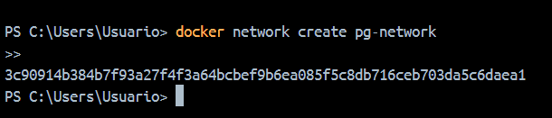
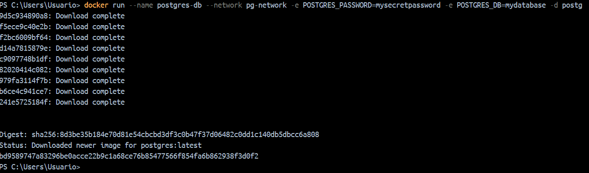
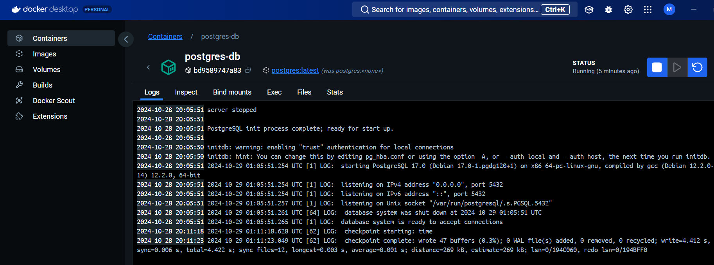
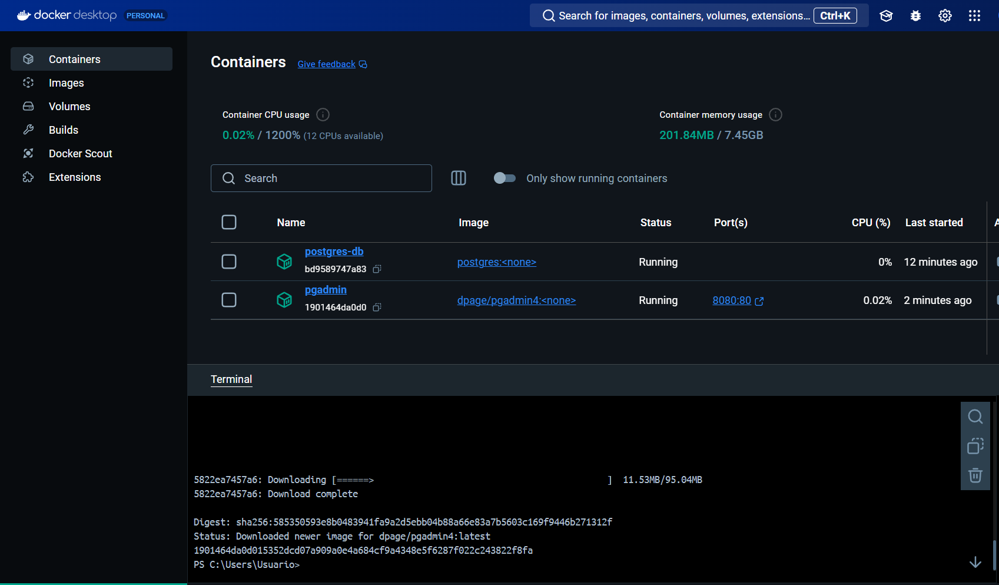
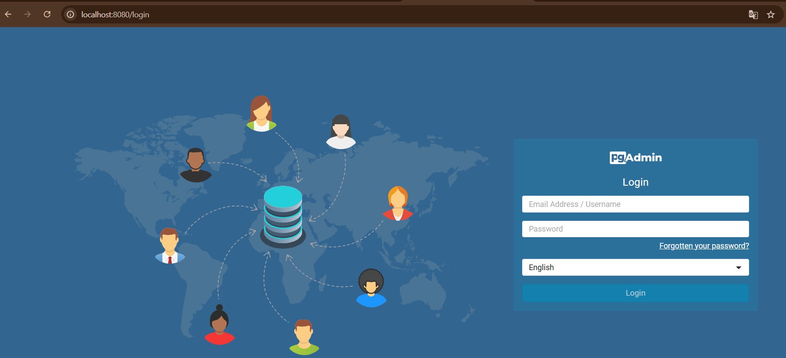
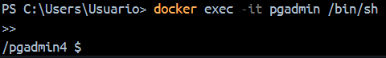
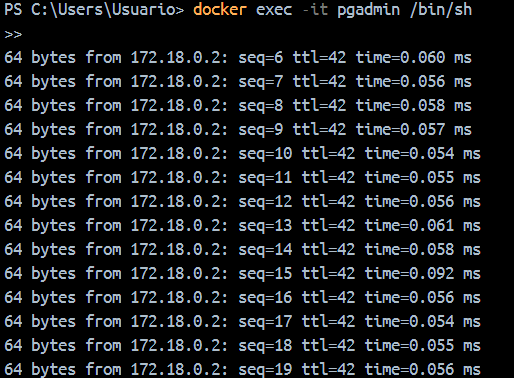
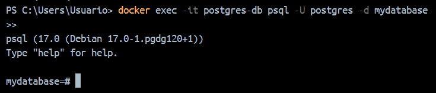

 Creación de una Red Docker Personalizada para PostgreSQL y pgAdmin

 1. Título
Creación de una Red Docker Personalizada para PostgreSQL y pgAdmin

 2. Tiempo de Duración
**30 minutos**

 3. Fundamentos

Docker es una plataforma que permite la creación de contenedores ligeros que contienen aplicaciones y sus dependencias, ofreciendo un entorno aislado, replicable y portátil. En esta práctica, utilizaremos Docker para crear una red personalizada que conecte dos contenedores: uno con PostgreSQL como base de datos y otro con pgAdmin, una herramienta gráfica para la administración de PostgreSQL.

PostgreSQL es una base de datos relacional de código abierto conocida por su robustez y escalabilidad. pgAdmin, por otro lado, es una interfaz gráfica popular para gestionar y consultar bases de datos PostgreSQL. Al usar Docker, podemos desplegar ambos servicios de manera eficiente, facilitando su conexión en un entorno aislado y controlado.

 Conceptos Clave:
- **Docker**: Plataforma que aísla aplicaciones en contenedores, asegurando entornos controlados y replicables.
- **PostgreSQL**: Sistema de gestión de bases de datos relacional de código abierto.
- **pgAdmin**: Herramienta gráfica para la administración de bases de datos PostgreSQL.
- **Red Docker**: Red interna que conecta varios contenedores para permitir la comunicación entre ellos.

## 4. Conocimientos Previos

- Conocimientos básicos de Linux.
- Familiaridad con Docker y la virtualización.
- Conocimientos de bases de datos relacionales (PostgreSQL).

## 5. Objetivos a Alcanzar

- Crear una red Docker personalizada.
- Desplegar un contenedor con PostgreSQL.
- Desplegar un contenedor con pgAdmin y conectarlo a PostgreSQL.
- Acceder a pgAdmin desde un navegador y configurar una conexión con PostgreSQL.

## 6. Equipo Necesario

- Computadora con sistema operativo **Windows**, **Linux** o **Mac**.
- Docker instalado en el equipo.

## 7. Material de Apoyo

- Guía de comandos básicos de Docker.
- Documentación oficial de [PostgreSQL](https://www.postgresql.org/docs/).
- Documentación oficial de [pgAdmin](https://www.pgadmin.org/docs/).

## 8. Procedimiento

### Paso 1: Crear una Red Docker Personalizada

```bash
docker network create pg-network
```
con este codigo creamos una red personalizada llamada pg-network


### Paso 2: Iniciar PostgreSQL

```bash
docker run --name postgres-db \
  --network pg-network \
  -e POSTGRES_PASSWORD=mysecretpassword \
  -e POSTGRES_DB=mydatabase \
  -d postgres

```
Este comando crea y ejecuta un contenedor de PostgreSQL en Docker, con el nombre postgres-db, conectado a una red personalizada llamada pg-network. El contenedor tiene una base de datos llamada mydatabase y una contraseña de administrador (mysecretpassword). Además, se ejecuta en segundo plano, lo que permite que otros contenedores, como pgAdmin, se conecten y gestionen la base de datos.

Y tambien se ve que se creo en docker DESKTOP 


### Paso 3: Iniciar pgAdmin

```bash
docker run --name pgadmin \
  --network pg-network \
  -e PGADMIN_DEFAULT_EMAIL=admin@example.com \
  -e PGADMIN_DEFAULT_PASSWORD=admin \
  -p 8080:80 \
  -d dpage/pgadmin4

```
Este comando crea y ejecuta un contenedor de pgAdmin en Docker, con el nombre pgadmin

Este comando crea y ejecuta un contenedor de pgAdmin en Docker con el nombre pgadmin, conectado a la red personalizada pg-network para comunicarse con otros contenedores (como PostgreSQL). Configura las credenciales predeterminadas de acceso a pgAdmin con el correo admin@example.com y la contraseña admin. Además, expone el puerto 80 del contenedor al puerto 8080 del host, lo que permite acceder a la interfaz de pgAdmin desde un navegador web usando http://localhost:8080


### Paso 4: Verificar Conexión entre Contenedores

Para probar que los contenedores pueden comunicarse entre sí, puedes acceder al contenedor de pgAdmin y usar herramientas como ping o psql para intentar conectarte al contenedor de PostgreSQL.

1.Acceder al Contenedor de pgAdmin:

```bash
docker exec -it pgadmin /bin/sh
```


Probar la Conexión:

2.Si tienes instalado ping, puedes intentar hacer ping al contenedor de PostgreSQL usando su nombre:

```bash
ping postgres-db
```


3.También se puede probar conectarte a PostgreSQL usando psql (si está instalado en el contenedor de pgAdmin):

```bash
psql -h postgres-db -U postgres -d mydatabase
```


Esto intentará conectarse al contenedor de PostgreSQL utilizando las credenciales que configuraste.

## 9. Resultados Esperados 
Al finalizar la configuración y las pruebas, deberías tener un entorno donde pgAdmin puede gestionar la base de datos PostgreSQL sin problemas, con ambos contenedores comunicándose correctamente dentro de la red personalizada. Esto permitirá realizar tareas de administración de bases de datos de manera eficiente a través de la interfaz gráfica de pgAdmin.

## 10. Bibliografía
PostgreSQL Global Development Group. (n.d.). PostgreSQL: The World's Most Advanced Open Source Relational Database

 Docker. (n.d.). Compose file reference.

 Neeraj, A. (2021). Dockerizing a PostgreSQL Database.#